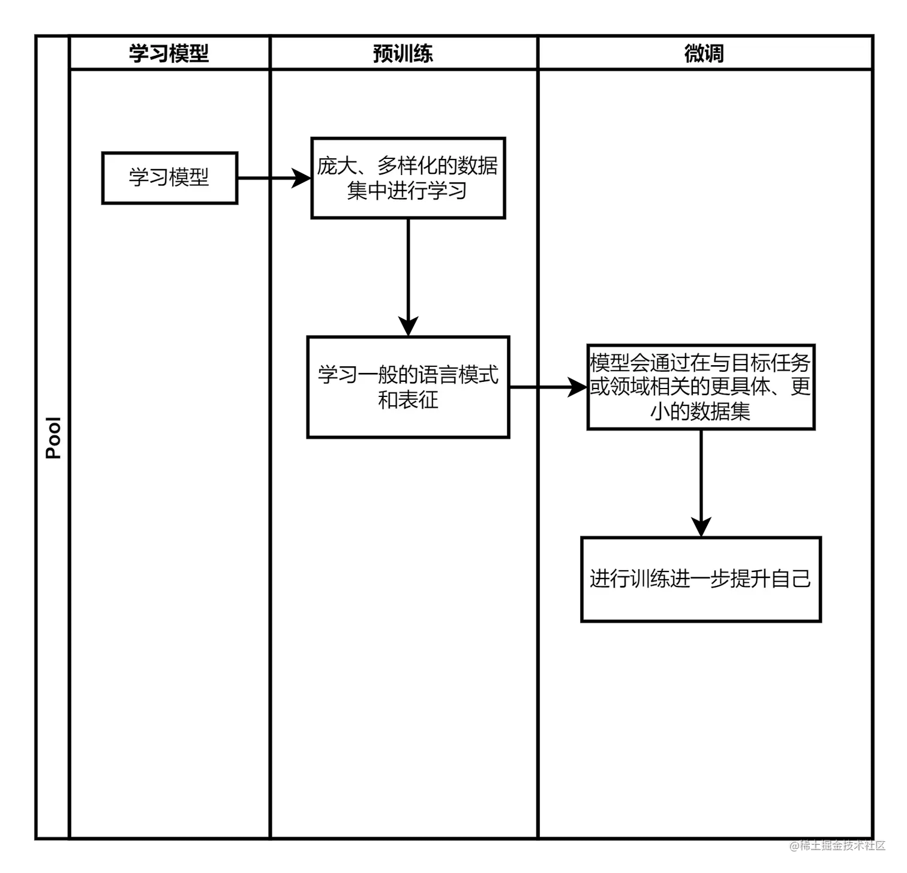
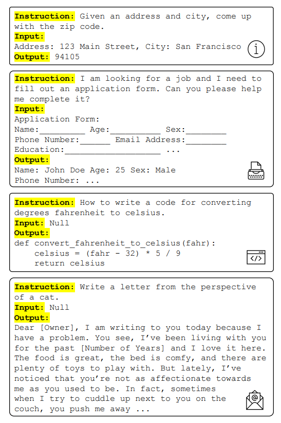
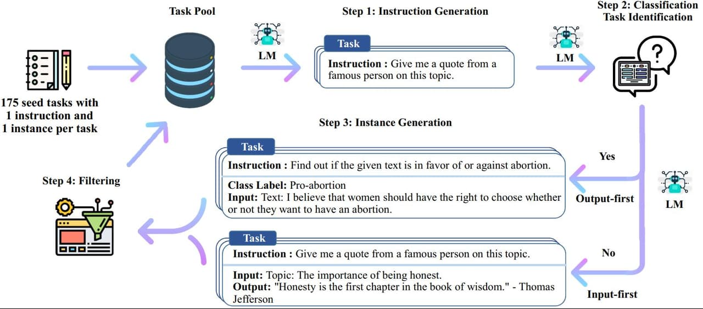

训练大型语言模型需要提供大量的文本数据，模型利用这些数据来学习人类语言的结构、语法和语义。

## LLM训练方式
### 机器学习类型
1. 监督学习
2. 无监督学习(不依赖标注数据)
3. 强化学习

### LLM训练与无监督学习
训练过程通常是通过无监督学习完成的，使用一种叫做自我监督学习的技术。在自我监督学习中，模型通过预测序列中的下一个词来标记输入的数据，并给出之前的词，从而生成自己的标签。这种方法使得模型可以在没有明确标注的情况下进行训练，从而大大降低了数据收集和标注的成本。[1](https://juejin.cn/post/7242965902877917245)

### 训练过程


### GPT框架中的预训练（Pre-Training）
目的：提高模型的泛化能力和通用能力
结果：生成基座模型（Base Model）

### 数据标注
对原始数据进行标记和分类，提供有意义的数据，以用于机器学习训练
目的：使模型更好地理解数据，提高准确率和效率
#### 重要性
1. 解决数据的精准性问题
原始数据存在噪音，非结构化
2. 让机器理解数据

以下是数据标注的解决方案：


自动标注(Automated Annotation)：利用机器学习模型执行初始的数据标注，然后由人工审查以保证数据质量。


主动学习(Active Learning)：机器学习模型建议哪些数据样本需要标注，从而减少所需的人工工作量。


众包(CrowdSourcing)：通过众包平台如Amazon Mechanical Turk，利用标注队伍分配标注任务，减少所需时间

## SFT数据
### 数据构成
SFT 通常采用标注的数据进行监督训练，这类数据被称为指令数据。指令数据本质上是一个问答对，但根据问题的具体程度，将指令分为以下三部分：
1. Instruction：描述具体任务的指令，如“请根据给定内容提炼摘要”。
2. Input：作为指令的补充，如上例中的给定内容。如果指令中的任务已明确，则其应为空。
3. Output：任务的解答。


### 数据生成方案
对于 SFT 这种标注数据，通常借助 LLM 进行批量生成，下面详细介绍数据生产方案。

#### Self-Instruct
提供人工标注的少量高质量种子指令数据，调用LLM生成和优化更多地指令。


#### 详细数据示例
以下是三个SFT阶段的人工标注好的种子指令数据例子：
##### 例子1：
```json
{
  "instruction": "请写一首关于春天的诗。",
  "input": "",
  "output": "春回大地万物苏，\n绿柳垂丝绘新图。\n花开满园香四溢，\n微风拂面心自舒。",
  "system": "诗歌创作",
  "history": []
}
```
这个例子中，指令是要求写一首关于春天的诗，输入为空，输出是一首描绘春天的诗。
##### 例子2：
```json
{
  "instruction": "解释一下相对论的基本原理。",
  "input": "",
  "output": "相对论是爱因斯坦提出的物理学理论，分为狭义相对论和广义相对论。狭义相对论主要讨论在没有重力作用的情况下，物体的运动规律，提出了时间和空间的相对性。广义相对论则扩展到有重力的情况，认为重力是时空弯曲的结果。",
  "system": "科学解释",
  "history": []
}
```
这个例子中，指令是解释相对论的基本原理，输入为空，输出是相对论的简要解释。
##### 例子3：
```json
{
  "instruction": "如何制作一杯拿铁咖啡？",
  "input": "",
  "output": "制作拿铁咖啡的步骤如下：1. 烧热牛奶至微沸。2. 用咖啡机萃取浓缩咖啡。3. 将热牛奶和浓缩咖啡按比例混合。4. 可以根据个人口味加入糖或香料。5. 混合均匀后即可享用。",
  "system": "生活技能",
  "history": []
}
```
这个例子中，指令是制作拿铁咖啡的方法，输入为空，输出是制作拿铁咖啡的步骤。
这些例子展示了SFT阶段种子指令数据的典型格式，包括指令、输入、输出和系统提示词，这些数据用于微调模型以更好地理解和执行人类指令。

在SFT（Supervised Fine-Tuning，监督微调）阶段的种子指令数据中，`history`字段通常用于记录对话历史或上下文信息。它的作用主要包括：
1. **保持上下文连贯性**：在多轮对话中，`history`字段可以存储之前的对话内容，确保模型在生成回复时能够考虑到之前的对话信息，从而保持对话的连贯性和一致性。
2. **提供背景信息**：`history`字段可以包含与当前指令相关的背景信息，帮助模型更好地理解指令的意图和上下文，从而生成更准确、相关的回复。
3. **辅助指令理解**：在某些情况下，指令可能需要结合之前的对话内容来理解。`history`字段提供了这些必要的信息，使模型能够更准确地解析和执行指令。
4. **训练模型处理复杂对话**：通过包含对话历史，`history`字段可以帮助模型学习如何处理复杂的多轮对话，提高模型在真实应用场景中的表现。
5. **避免重复信息**：`history`字段可以避免在每条指令中重复之前已经提供的信息，使数据更加简洁高效。
例如，在多轮对话中，用户可能会在后续指令中引用之前的信息，而没有明确指出。`history`字段确保模型能够识别这些引用并作出适当的回应。
```json
{
  "instruction": "请继续解释相对论的其他应用。",
  "input": "",
  "output": "相对论在其他领域也有广泛应用，比如在GPS系统中，由于卫星和地面之间的时间差异，需要利用相对论进行修正，以确保定位的准确性。",
  "system": "科学解释",
  "history": [
    "用户：解释一下相对论的基本原理。",
    "助手：相对论是爱因斯坦提出的物理学理论，分为狭义相对论和广义相对论。狭义相对论主要讨论在没有重力作用的情况下，物体的运动规律，提出了时间和空间的相对性。广义相对论则扩展到有重力的情况，认为重力是时空弯曲的结果。"
  ]
}
```
在这个例子中，`history`字段记录了用户和助手之前的对话，帮助模型理解用户想要继续了解相对论的其他应用，而不是重新解释基本原理。


## 参考文献
[LLM、AGI和AIGC都是什么](https://juejin.cn/post/7242965902877917245)

[NLP、GPT-Pre-Training和数据标注都是什么](https://juejin.cn/post/7243311106685059129)

[SFT 指令数据生产](https://www.raygecao.cn/posts/data-generator/)

